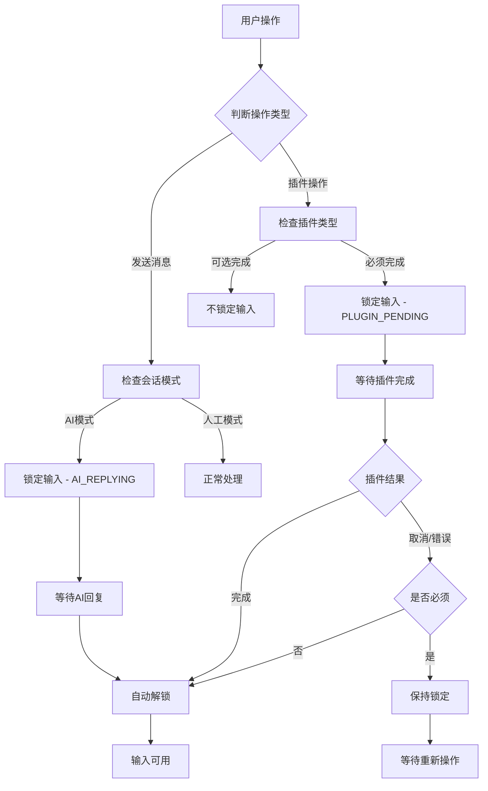

# LiaoKit 会话状态管理完整使用说明


## 🎯 功能概述

LiaoKit 会话状态管理是一个全局状态控制系统，专为智能客服、AI 对话和多流程卡片驱动等场景设计。它提供了完整的会话状态管理、输入锁定控制和插件生命周期管理能力。

### 核心特性

- 🔒 **智能锁定控制** - 自动管理输入锁定状态，防止用户在不当时机输入
- 🤖 **会话模式切换** - 支持 AI 模式和人工模式的无缝切换
- 🔌 **插件生命周期** - 完整的插件状态管理和必须完成控制
- ⏰ **自动解锁机制** - 防止永久锁定的安全保护机制
- 📊 **实时状态监控** - 提供详细的状态变化事件和日志
- 🔧 **高度可配置** - 支持细粒度的状态控制和自定义配置

## 📦 架构设计

### 组件层级架构

```
┌─────────────────────────────────────────────┐
│                LiaoWindow                   │
│         (全局状态管理器)                     │
│                                             │
│  ┌─────────────────────────────────────────┐│
│  │          子组件状态注入                  ││
│  │    (通过provide/inject机制)              ││
│  └─────────────────────────────────────────┘│
│                                             │
│  ┌──────────────────┐ ┌─────────────────────┐│
│  │  LiaoInputArea   │ │  LiaoPluginBubble   ││
│  │   (状态响应者)    │ │   (状态触发者)       ││
│  └──────────────────┘ └─────────────────────┘│
└─────────────────────────────────────────────┘
```

### 状态管理流程



## 🔧 核心API

### 会话状态类型

```typescript
// 会话模式类型
export type SessionMode = 'AI' | 'human';

// 锁定原因类型
export type LockReason = 
  | 'AI_REPLYING'      // AI正在回复中
  | 'PLUGIN_PENDING'   // 插件操作待完成  
  | 'FORM_REQUIRED'    // 表单填写必须完成
  | 'VOTE_REQUIRED'    // 投票选择必须完成
  | 'CUSTOM'           // 自定义锁定原因
  | null;

// 活跃插件信息
export interface ActivePlugin {
  id: string | number;     // 插件唯一标识
  type: string;           // 插件类型
  messageId?: string | number;  // 关联的消息ID
  required?: boolean;     // 是否必须完成
  data?: any;            // 插件数据
}

// 全局状态管理接口
export interface LiaoSessionState {
  sessionMode: SessionMode;           // 当前会话模式
  isInputLocked: boolean;            // 输入是否被锁定
  activePlugin: ActivePlugin | null; // 当前活跃插件
  lockReason: LockReason;            // 锁定原因
  lockInput: (reason: LockReason, plugin?: ActivePlugin) => void;
  unlockInput: () => void;
  emergencyUnlock: () => void;
}
```

### 锁定原因优先级

```typescript
const lockReasonPriority = {
  'AI_REPLYING': 1,        // 最高优先级
  'PLUGIN_PENDING': 2,
  'FORM_REQUIRED': 3,
  'VOTE_REQUIRED': 4,
  'CUSTOM': 5              // 最低优先级
};
```

**说明**: 高优先级的锁定可以覆盖低优先级的锁定状态。

## 🏗️ 基础使用

### 1. 基础窗口配置

```vue
<template>
  <LiaoWindow
    :default-session-mode="'human'"
    :auto-unlock-timeout="30000"
    :enable-emergency-unlock="true"
    @session-mode-change="handleSessionModeChange"
    @input-lock-change="handleLockChange"
    @plugin-complete="handlePluginComplete"
    @plugin-cancel="handlePluginCancel"
    @plugin-error="handlePluginError"
    @emergency-unlock="handleEmergencyUnlock"
  >
    <LiaoMessageList 
      :messages="messages"
      @plugin-complete="handlePluginComplete"
    />
    <LiaoInputArea 
      v-model="inputText"
      @send="handleSendMessage"
    />
  </LiaoWindow>
</template>

<script setup>
import { ref } from 'vue'
import { LiaoWindow, LiaoMessageList, LiaoInputArea } from '@yuandezuohua/liaokit'

const inputText = ref('')
const messages = ref([])

// 处理会话模式变化
const handleSessionModeChange = ({ oldMode, newMode }) => {
  console.log(`会话模式从 ${oldMode} 切换到 ${newMode}`)
}

// 处理锁定状态变化
const handleLockChange = ({ locked, reason, plugin }) => {
  if (locked) {
    console.log(`输入已锁定: ${reason}`)
  } else {
    console.log('输入已解锁')
  }
}

// 处理消息发送
const handleSendMessage = (message) => {
  messages.value.push({
    id: Date.now(),
    type: 'text',
    content: message,
    isSelf: true,
    time: new Date(),
    status: 'sent'
  })
  inputText.value = ''
}
</script>
```

### 2. 插件必须完成控制

```vue
<template>
  <LiaoWindow>
    <LiaoMessageList :messages="messagesWithPlugin" />
    <LiaoInputArea />
  </LiaoWindow>
</template>

<script setup>
const messagesWithPlugin = ref([
  {
    id: 1,
    type: 'text',
    content: '请完成以下表单填写：',
    isSelf: false,
    time: new Date(),
    status: 'sent'
  },
  {
    id: 2,
    type: 'plugin',
    pluginType: 'form',
    pluginRequired: true,  // 必须完成，会锁定输入
    pluginData: {
      fields: [
        { name: 'name', label: '姓名', type: 'text', required: true },
        { name: 'email', label: '邮箱', type: 'email', required: true }
      ]
    },
    isSelf: false,
    time: new Date(),
    status: 'sent'
  },
  {
    id: 3,
    type: 'plugin', 
    pluginType: 'info',
    pluginRequired: false, // 非必须，不会锁定输入
    pluginData: {
      title: '温馨提示',
      content: '这是一个信息展示插件'
    },
    isSelf: false,
    time: new Date(),
    status: 'sent'
  }
])
</script>
```

## 🎛️ 高级配置

### 1. 状态管理器模式

```vue
<template>
  <LiaoWindow
    ref="windowRef"
    :default-session-mode="sessionMode"
    :auto-unlock-timeout="autoUnlockTime"
    @input-lock-change="handleLockChange"
  >
    <template #default="{ 
      sessionMode: currentMode,
      isInputLocked,
      activePlugin,
      lockReason,
      onLockInput,
      onUnlockInput,
      onEmergencyUnlock
    }">
      <div class="chat-container">
        <!-- 状态显示面板 -->
        <div class="status-panel">
          <div class="status-item">
            <label>会话模式：</label>
            <span :class="'mode-' + currentMode">
              {{ currentMode === 'AI' ? '🤖 AI模式' : '👥 人工模式' }}
            </span>
          </div>
          <div class="status-item">
            <label>输入状态：</label>
            <span :class="{ locked: isInputLocked }">
              {{ isInputLocked ? '🔒 已锁定' : '🔓 可输入' }}
            </span>
          </div>
          <div class="status-item">
            <label>锁定原因：</label>
            <span>{{ lockReason ? getLockReasonText(lockReason) : '无' }}</span>
          </div>
        </div>

        <!-- 聊天区域 -->
        <LiaoMessageList :messages="messages" />
        
        <!-- 控制面板 -->
        <div class="control-panel">
          <button @click="() => onLockInput('AI_REPLYING')">
            模拟AI回复锁定
          </button>
          <button @click="() => onLockInput('CUSTOM')">
            自定义锁定
          </button>
          <button @click="onUnlockInput">
            手动解锁
          </button>
          <button @click="onEmergencyUnlock">
            紧急解锁
          </button>
        </div>

        <LiaoInputArea />
      </div>
    </template>
  </LiaoWindow>
</template>

<script setup>
import { ref, computed } from 'vue'

const windowRef = ref()
const sessionMode = ref('human')
const autoUnlockTime = ref(30000)

// 根据模式动态调整超时时间
const adjustedTimeout = computed(() => {
  return sessionMode.value === 'AI' ? 15000 : 60000
})

// 锁定原因文本映射
const getLockReasonText = (reason) => {
  const reasonMap = {
    'AI_REPLYING': 'AI正在回复中',
    'PLUGIN_PENDING': '插件操作待完成',
    'FORM_REQUIRED': '表单填写必须完成',
    'VOTE_REQUIRED': '投票选择必须完成',
    'CUSTOM': '自定义锁定'
  }
  return reasonMap[reason] || '未知原因'
}

// 动态切换模式
const switchToAI = () => {
  windowRef.value.setSessionMode('AI')
}

const switchToHuman = () => {
  windowRef.value.setSessionMode('human')
}
</script>
```

### 2. AI 对话流程控制

```vue
<template>
  <LiaoWindow
    ref="windowRef"
    :default-session-mode="'AI'"
    @input-lock-change="handleLockChange"
  >
    <LiaoMessageList :messages="messages" />
    <LiaoInputArea @send="handleAIChat" />
  </LiaoWindow>
</template>

<script setup>
import { ref } from 'vue'

const windowRef = ref()
const messages = ref([])
const isAIThinking = ref(false)

const handleAIChat = async (userMessage) => {
  // 添加用户消息
  messages.value.push({
    id: Date.now(),
    type: 'text',
    content: userMessage,
    isSelf: true,
    time: new Date(),
    status: 'sent'
  })

  // 锁定输入，显示AI思考状态
  windowRef.value.lockInput('AI_REPLYING')
  isAIThinking.value = true

  try {
    // 模拟AI思考过程
    await simulateAIThinking()
    
    // 调用AI API获取回复
    const aiResponse = await callAIAPI(userMessage)
    
    // 添加AI回复
    messages.value.push({
      id: Date.now(),
      type: 'text',
      content: aiResponse,
      isSelf: false,
      name: 'AI助手',
      avatar: '🤖',
      time: new Date(),
      status: 'sent'
    })

  } catch (error) {
    console.error('AI回复失败:', error)
    
    // 添加错误提示
    messages.value.push({
      id: Date.now(),
      type: 'text',
      content: '抱歉，AI暂时无法回复，请稍后重试。',
      isSelf: false,
      name: 'AI助手',
      avatar: '🤖',
      time: new Date(),
      status: 'sent'
    })
  } finally {
    // 解锁输入
    windowRef.value.unlockInput()
    isAIThinking.value = false
  }
}

const simulateAIThinking = () => {
  return new Promise(resolve => {
    // 模拟AI思考时间
    setTimeout(resolve, 2000)
  })
}

const callAIAPI = async (message) => {
  // 这里调用实际的AI API
  // 返回模拟回复
  return `我理解您的问题："${message}"，这是我的回复...`
}
</script>
```

### 3. 复杂插件流程控制

```vue
<template>
  <LiaoWindow
    ref="windowRef"
    @plugin-complete="handlePluginComplete"
    @plugin-cancel="handlePluginCancel" 
    @plugin-error="handlePluginError"
  >
    <LiaoMessageList :messages="complexMessages" />
    <LiaoInputArea />
  </LiaoWindow>
</template>

<script setup>
import { ref } from 'vue'

const windowRef = ref()

const complexMessages = ref([
  {
    id: 1,
    type: 'text',
    content: '欢迎使用智能客服系统！',
    isSelf: false,
    time: new Date(),
    status: 'sent'
  },
  {
    id: 2,
    type: 'plugin',
    pluginType: 'vote',
    pluginRequired: true, // 必须完成投票
    pluginData: {
      title: '请选择您的问题类型',
      options: [
        { id: 1, text: '账户问题', value: 'account' },
        { id: 2, text: '技术支持', value: 'tech' },
        { id: 3, text: '产品咨询', value: 'product' }
      ],
      allowMultiple: false
    },
    isSelf: false,
    time: new Date(),
    status: 'sent'
  },
  {
    id: 3,
    type: 'plugin',
    pluginType: 'form',
    pluginRequired: false, // 可选填写
    pluginData: {
      title: '详细信息（可选）',
      fields: [
        { name: 'phone', label: '联系电话', type: 'tel' },
        { name: 'description', label: '问题描述', type: 'textarea' }
      ]
    },
    isSelf: false,
    time: new Date(),
    status: 'sent'
  }
])

// 处理插件完成
const handlePluginComplete = (data) => {
  console.log('插件完成:', data)
  
  if (data.pluginType === 'vote') {
    // 投票完成后，根据选择展示不同内容
    const selectedOption = data.result.selectedOptions[0]
    
    messages.value.push({
      id: Date.now(),
      type: 'text',
      content: `您选择了"${selectedOption.text}"，我将为您提供专业的${selectedOption.text}服务。`,
      isSelf: false,
      time: new Date(),
      status: 'sent'
    })
  }
  
  // 自动解锁输入（由系统处理）
}

// 处理插件取消
const handlePluginCancel = (data) => {
  console.log('插件取消:', data)
  
  if (data.pluginRequired) {
    // 必须完成的插件被取消，提示用户
    messages.value.push({
      id: Date.now(),
      type: 'text',
      content: '该操作是必须完成的，请重新选择。',
      isSelf: false,
      time: new Date(),
      status: 'sent'
    })
    // 保持锁定状态
  } else {
    // 可选插件取消，继续流程
    messages.value.push({
      id: Date.now(),
      type: 'text',
      content: '已跳过可选操作，有什么可以帮助您的吗？',
      isSelf: false,
      time: new Date(),
      status: 'sent'
    })
  }
}

// 处理插件错误
const handlePluginError = (data) => {
  console.error('插件错误:', data)
  
  messages.value.push({
    id: Date.now(),
    type: 'text',
    content: '操作出现异常，请重试或联系客服。',
    isSelf: false,
    time: new Date(),
    status: 'sent'
  })
  
  // 根据是否必须完成决定是否解锁
  if (!data.pluginRequired) {
    windowRef.value.unlockInput()
  }
}
</script>
```

## 🔧 状态控制方法

### 手动状态控制

```typescript
// 获取窗口组件引用
const windowRef = ref<InstanceType<typeof LiaoWindow>>()

// 手动锁定输入
const lockInput = (reason: LockReason, plugin?: ActivePlugin) => {
  windowRef.value?.lockInput(reason, plugin)
}

// 手动解锁输入
const unlockInput = () => {
  windowRef.value?.unlockInput()
}

// 紧急解锁（无条件解锁）
const emergencyUnlock = () => {
  windowRef.value?.emergencyUnlock()
}

// 切换会话模式
const setSessionMode = (mode: SessionMode) => {
  windowRef.value?.setSessionMode(mode)
}
```

### 状态监听

```vue
<template>
  <LiaoWindow
    @session-mode-change="onSessionModeChange"
    @input-lock-change="onInputLockChange"
    @plugin-complete="onPluginComplete"
    @plugin-cancel="onPluginCancel"
    @plugin-error="onPluginError"
    @emergency-unlock="onEmergencyUnlock"
  >
    <!-- 内容 -->
  </LiaoWindow>
</template>

<script setup>
// 会话模式变化监听
const onSessionModeChange = ({ oldMode, newMode }) => {
  console.log(`会话模式从 ${oldMode} 切换到 ${newMode}`)
  
  // 根据模式调整界面
  if (newMode === 'AI') {
    // AI模式的特殊处理
    setupAIMode()
  } else {
    // 人工模式的特殊处理
    setupHumanMode()
  }
}

// 输入锁定状态变化监听
const onInputLockChange = ({ locked, reason, plugin }) => {
  console.log('锁定状态变化:', { locked, reason, plugin })
  
  if (locked) {
    // 显示锁定状态指示器
    showLockIndicator(reason)
  } else {
    // 隐藏锁定状态指示器
    hideLockIndicator()
  }
}

// 插件完成监听
const onPluginComplete = (data) => {
  console.log('插件完成:', data)
  
  // 记录用户操作
  logUserAction('plugin_complete', data)
  
  // 可能的后续处理
  handlePluginResult(data)
}

// 插件取消监听
const onPluginCancel = (data) => {
  console.log('插件取消:', data)
  
  // 记录用户操作
  logUserAction('plugin_cancel', data)
  
  // 处理取消逻辑
  handlePluginCancel(data)
}

// 插件错误监听
const onPluginError = (data) => {
  console.error('插件错误:', data)
  
  // 记录错误信息
  logError('plugin_error', data)
  
  // 错误恢复处理
  handlePluginError(data)
}

// 紧急解锁监听
const onEmergencyUnlock = () => {
  console.warn('触发紧急解锁')
  
  // 记录紧急解锁事件
  logEmergencyEvent('emergency_unlock')
  
  // 可能的清理操作
  cleanupLockedState()
}
</script>
```

## ⏰ 自动解锁机制

### 基础自动解锁

```vue
<template>
  <LiaoWindow
    :auto-unlock-timeout="30000"  <!-- 30秒自动解锁 -->
    :enable-emergency-unlock="true"
    @emergency-unlock="handleTimeout"
  >
    <!-- 内容 -->
  </LiaoWindow>
</template>

<script setup>
const handleTimeout = () => {
  console.log('自动解锁触发')
  
  // 可以在这里做一些清理工作
  cleanupState()
  
  // 通知用户
  showNotification('由于长时间无操作，已自动解锁输入')
}
</script>
```

### 智能自动解锁

```vue
<template>
  <LiaoWindow
    ref="windowRef"
    :auto-unlock-timeout="dynamicTimeout"
    @input-lock-change="handleLockChange"
  >
    <!-- 内容 -->
  </LiaoWindow>
</template>

<script setup>
import { ref, computed } from 'vue'

const windowRef = ref()
const currentLockReason = ref(null)
const sessionMode = ref('human')

// 根据锁定原因动态调整超时时间
const dynamicTimeout = computed(() => {
  switch (currentLockReason.value) {
    case 'AI_REPLYING':
      return 15000  // AI回复最多等待15秒
    case 'FORM_REQUIRED':
      return 300000 // 表单填写最多等待5分钟
    case 'VOTE_REQUIRED':
      return 60000  // 投票选择最多等待1分钟
    case 'PLUGIN_PENDING':
      return 120000 // 插件操作最多等待2分钟
    default:
      return 30000  // 默认30秒
  }
})

const handleLockChange = ({ locked, reason }) => {
  currentLockReason.value = reason
  
  if (locked) {
    console.log(`锁定输入，预计${dynamicTimeout.value / 1000}秒后自动解锁`)
  }
}
</script>
```

## 🎯 最佳实践

### 1. 状态管理最佳实践

```typescript
// ✅ 推荐：单一状态源
const sessionState = provide(LIAO_SESSION_STATE_KEY, {
  sessionMode,
  isInputLocked,
  activePlugin,
  lockReason,
  lockInput,
  unlockInput,
  emergencyUnlock
})

// ❌ 避免：多个状态源
const localLocked = ref(false)
const globalLocked = inject(LIAO_SESSION_STATE_KEY)
```

```typescript
// ✅ 推荐：明确的状态更新
const lockInput = (reason: LockReason, plugin?: ActivePlugin) => {
  // 清除之前的定时器
  clearAutoUnlockTimer()
  
  // 更新状态
  isInputLocked.value = true
  lockReason.value = reason
  activePlugin.value = plugin
  
  // 设置新的定时器
  setAutoUnlockTimer()
  
  // 通知状态变化
  emit('input-lock-change', { locked: true, reason, plugin })
}

// ❌ 避免：直接修改状态
isInputLocked.value = true // 没有处理副作用
```

### 2. 插件设计最佳实践

```vue
<!-- ✅ 推荐：明确的必须完成标识 -->
<template>
  <div v-for="message in messages" :key="message.id">
    <LiaoPluginBubble
      v-if="message.type === 'plugin'"
      :plugin-type="message.pluginType"
      :plugin-data="message.pluginData"
      :plugin-required="message.pluginRequired ?? false"
      @complete="handlePluginComplete"
      @cancel="handlePluginCancel"
      @error="handlePluginError"
    />
  </div>
</template>

<!-- ❌ 避免：不明确的状态控制 -->
<template>
  <LiaoPluginBubble
    :plugin-type="message.pluginType"
    :should-lock="someBusinessLogic(message)" <!-- 业务逻辑混入组件 -->
  />
</template>
```

### 3. 错误处理最佳实践

```typescript
// ✅ 推荐：完整的错误处理
const handlePluginError = async (data) => {
  try {
    // 记录错误
    logger.error('插件错误', data)
    
    // 根据错误类型决定处理策略
    if (data.error.retryable) {
      // 可重试的错误
      showRetryDialog(data)
    } else {
      // 不可重试的错误，解锁输入
      if (!data.pluginRequired) {
        unlockInput()
      }
    }
    
    // 通知用户
    showErrorMessage(data.error.message)
    
  } catch (error) {
    // 错误处理失败，强制解锁
    emergencyUnlock()
  }
}

// ❌ 避免：忽略错误处理
const handlePluginError = (data) => {
  console.log('出错了') // 处理不充分
}
```

### 4. 性能优化最佳实践

```vue
<template>
  <LiaoWindow>
    <!-- ✅ 推荐：使用 v-memo 优化大量消息渲染 -->
    <LiaoMessageList>
      <div 
        v-for="message in messages" 
        :key="message.id"
        v-memo="[message.status, message.pluginRequired]"
      >
        <LiaoPluginBubble
          v-if="message.type === 'plugin'"
          :plugin-required="message.pluginRequired"
          @complete="handlePluginComplete"
        />
      </div>
    </LiaoMessageList>
  </LiaoWindow>
</template>

<script setup>
import { computed, shallowRef } from 'vue'

// ✅ 推荐：使用 shallowRef 优化大型状态对象
const sessionState = shallowRef({
  sessionMode: 'human',
  isInputLocked: false,
  activePlugin: null,
  lockReason: null
})

// ✅ 推荐：防抖处理频繁的状态变化
const debouncedLockInput = debounce((reason, plugin) => {
  lockInput(reason, plugin)
}, 100)
</script>
```

## 🔍 调试和监控

### 状态调试工具

```vue
<template>
  <LiaoWindow @input-lock-change="logStateChange">
    <!-- 开发环境下显示调试面板 -->
    <div v-if="isDevelopment" class="debug-panel">
      <h3>🔍 状态调试面板</h3>
      <div class="debug-info">
        <div>会话模式: {{ currentSessionMode }}</div>
        <div>输入锁定: {{ isInputLocked ? '🔒' : '🔓' }}</div>
        <div>锁定原因: {{ lockReason || '无' }}</div>
        <div>活跃插件: {{ activePlugin?.type || '无' }}</div>
        <div>状态变化历史:</div>
        <ul>
          <li v-for="log in stateLogs" :key="log.id">
            {{ log.timestamp }}: {{ log.message }}
          </li>
        </ul>
      </div>
    </div>

    <LiaoMessageList :messages="messages" />
    <LiaoInputArea />
  </LiaoWindow>
</template>

<script setup>
import { ref } from 'vue'

const isDevelopment = process.env.NODE_ENV === 'development'
const stateLogs = ref([])

const logStateChange = (changeInfo) => {
  stateLogs.value.unshift({
    id: Date.now(),
    timestamp: new Date().toLocaleTimeString(),
    message: `状态变化: ${JSON.stringify(changeInfo)}`
  })
  
  // 限制日志数量
  if (stateLogs.value.length > 50) {
    stateLogs.value = stateLogs.value.slice(0, 50)
  }
}
</script>
```

### 性能监控

```typescript
// 状态变化性能监控
class SessionStateMonitor {
  private startTime: number = 0
  private changeCount: number = 0
  
  startMonitoring() {
    this.startTime = performance.now()
    this.changeCount = 0
  }
  
  recordStateChange(changeType: string) {
    this.changeCount++
    
    const currentTime = performance.now()
    const duration = currentTime - this.startTime
    
    console.log(`状态变化 [${changeType}]: 第${this.changeCount}次, 耗时${duration.toFixed(2)}ms`)
    
    // 检测异常频繁的状态变化
    if (this.changeCount > 10 && duration < 1000) {
      console.warn('检测到异常频繁的状态变化，可能存在性能问题')
    }
  }
  
  getStatistics() {
    const duration = performance.now() - this.startTime
    return {
      totalChanges: this.changeCount,
      totalDuration: duration,
      averageChangeInterval: duration / this.changeCount
    }
  }
}

// 使用监控器
const monitor = new SessionStateMonitor()
monitor.startMonitoring()

// 在状态变化时记录
const lockInput = (reason, plugin) => {
  monitor.recordStateChange('lock_input')
  // ... 锁定逻辑
}
```

## 🚨 常见问题与解决方案

### Q1: 输入一直被锁定，无法解除怎么办？

**A**: 这通常是由于插件异常或状态管理错误导致的。

**解决方案**:
```typescript
// 1. 检查是否有必须完成的插件未正确处理
console.log('当前活跃插件:', sessionState.activePlugin)

// 2. 使用紧急解锁
windowRef.value?.emergencyUnlock()

// 3. 检查自动解锁是否正常工作
console.log('自动解锁超时时间:', props.autoUnlockTimeout)

// 4. 手动清理状态（最后手段）
sessionState.isInputLocked = false
sessionState.lockReason = null
sessionState.activePlugin = null
```

### Q2: 插件完成后输入仍然被锁定？

**A**: 检查插件的 `pluginRequired` 设置和事件处理。

**解决方案**:
```typescript
// 1. 确保插件正确发送完成事件
const handlePluginAction = (action) => {
  if (action.type === 'complete') {
    emit('complete', {
      pluginType: props.pluginType,
      result: action.data
    })
  }
}

// 2. 检查父组件是否正确处理完成事件
const handlePluginComplete = (data) => {
  console.log('插件完成事件:', data)
  // 确保调用解锁
  windowRef.value?.unlockInput()
}

// 3. 检查插件是否标记为必须完成
if (message.pluginRequired === false) {
  // 非必须完成的插件应该不会锁定输入
}
```

### Q3: 会话模式切换后状态异常？

**A**: 检查模式切换的时机和状态清理。

**解决方案**:
```typescript
// 1. 在模式切换前清理状态
const switchSessionMode = (newMode) => {
  // 先解锁输入
  windowRef.value?.unlockInput()
  
  // 再切换模式
  windowRef.value?.setSessionMode(newMode)
}

// 2. 监听模式变化，调整相关配置
const handleSessionModeChange = ({ oldMode, newMode }) => {
  if (newMode === 'AI') {
    // AI模式下设置较短的超时时间
    autoUnlockTimeout.value = 15000
  } else {
    // 人工模式下设置较长的超时时间
    autoUnlockTimeout.value = 60000
  }
}
```

### Q4: 性能问题，状态变化过于频繁？

**A**: 优化状态更新频率和渲染性能。

**解决方案**:
```typescript
// 1. 使用防抖处理频繁的状态变化
import { debounce } from 'lodash-es'

const debouncedLockInput = debounce((reason, plugin) => {
  sessionState.lockInput(reason, plugin)
}, 100)

// 2. 使用 v-memo 优化渲染
<div v-memo="[sessionState.isInputLocked, sessionState.lockReason]">
  <!-- 状态相关的渲染内容 -->
</div>

// 3. 避免不必要的状态更新
const lockInput = (reason, plugin) => {
  // 检查状态是否真的需要更新
  if (sessionState.isInputLocked && sessionState.lockReason === reason) {
    return // 避免重复更新
  }
  
  // 执行状态更新
  sessionState.lockInput(reason, plugin)
}
```

## 📚 相关文档

- [LiaoWindow 组件文档](./LiaoWindow.md)
- [LiaoInputArea 组件文档](./LiaoInputArea.md)
- [LiaoPluginBubble 组件文档](./LiaoPluginBubble.md)
- [LiaoMessageList 组件文档](./LiaoMessageList.md)

## 🔄 更新日志

### v2.7.5 (2025-06-25)
- ✅ 完善会话状态管理使用说明
- ✅ 新增详细的API文档和使用示例
- ✅ 增加最佳实践指导
- ✅ 完善错误处理和调试指南

### v2.7.0 (2025-06-16)
- ✅ 初始版本发布
- ✅ 实现全局状态管理
- ✅ 支持输入锁定控制
- ✅ 支持插件必须完成状态
- ✅ 添加自动解锁机制

---

📄 **技术支持**: 如遇到问题，请参考 [常见问题解答](../FAQ.md) 或提交 [Issue](https://github.com/html1602/LiaoKit/issues) 